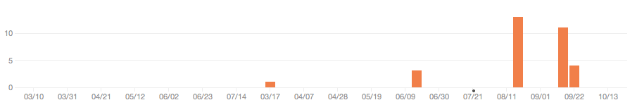
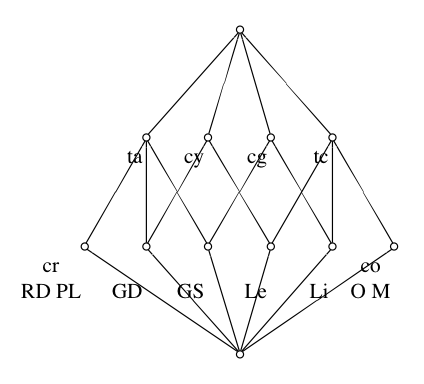
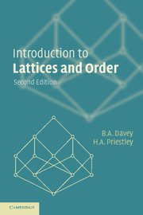

% A Complete Idiot's Guide to Formal Concept Analysis (in Haskell)
% Thomas Sutton
% 2013-10-16

# Introduction

Volunteering to talk at [FP-Syd][] was supposed to motivate me to finish a
project I started a while ago. Alas it didn't work and, while I learned how to
use [test-framework][], [language-css-attoparsec][] has seen too little effort
to be work demonstrating:

[FP-Syd]: http://fp-syd.ouroborus.net
[language-css-attoparsec]: https://github.com/thsutton/language-css-attoparsec
[test-framework]: http://hackage.haskell.org/package/test-framework

Instead I'll be talking about some Haskell code I wrote to perform
*formal concept analysis*.

# Caveats

- I'm pretty bad at programming in Haskell and the code I'm talking about
is pretty bad code.

- I'm pretty bad at mathematics and the explanation I give here is
probably pretty bad.

If you notice me say something wrong or silly please shout out and let
me know. Or talk to me afterwards.

# Formal Concept Analysis

*Formal concept analysis* is a mathematical formalism which analyses the data in
a *context* and attempts to extract the *concepts* embodied within that data.

Relating it to similar techniques, *formal concept analysis* might be thought of
as the love child of *decision tree learning* and *k-means clustering*.

# Contexts

A *context* is a structure which relates a set of objects with a set of
attributes.

Formally, a context is a triple:

$$(G, M, I)$$

- $G$ (from *gegenstände*) is the set of objects;

- $M$ (from *merkmale*) is the set of attributes; and

- $I$ is the relation linking $G$ and $M$.

# Context Table

Name               C=R C=G C=Y C=O T=A T=C
-----------------  --- --- --- --- --- ---
Pink Lady           X               X
Granny Smith            X           X
Golden Delicious            X       X
Red Delicious       X               X
Lemon                       X           X
Orange                          X       X
Mandarin                        X       X
Lime                    X               X

# Concepts

A *concept* (with respect to some context) is a pair of sets: a set of objects
and a set of attributes (the *extent* and *intent* of the concept respectively).

$$(A \subseteq G , B \subseteq M)$$

- $A$ is the set of all objects which have all the attributes in $B$;
  and

- $B$ is the set of all attributes which apply to all objects in $A$.

(This has something to do with Galois connections and stuff. I don't
know what that means, but yeah.)

# Basic Algorithm

1. Construct an adjacency matrix of the context.

2. Initialise a table of attributes/objects. Add the initial "all the things"
   entry.

3. For each attribute, in order of "maximal-ness":

	1. If the extent is already present, add the attribute to that row.
	2. Otherwise:
	    1. Add a new row.
		2. Add the intersections with previous rows (if not already present).

4. Add a final "none of the things" entry.

4. Generate `dot` code of the lattice:

    1. Each row becomes a node (labelled w/ attributes); and
	2. Each node has edges to it's *covering* nodes (immediate, proper
	   supersets).

# The Code

- Parse CSV input using the [cassava][] package.
- Use `containers` and `vector` for data representation.
- (Investigate using `Data.Bits` instead of `Data.Set` in future.)

[cassava]: http://hackage.haskell.org/package/cassava

# Example

Name               Colour   Type
-----------------  -------  -----
Pink Lady          Red      Apple
Granny Smith       Green    Apple
Golden Delicious   Yellow   Apple
Red Delicious      Red      Apple
Lemon              Yellow   Citrus
Orange             Orange   Citrus
Mandarin           Orange   Citrus
Lime               Green    Citrus

# The Fruit Lattice

# Sources

Most of this comes from *Introduction to Lattices and Order* (second
edition) by B. A. Davey and H. A. Priestly. There's also
[Wikipedia article on formal concept analysis][wiki].

[wiki]: http://en.wikipedia.org/wiki/Formal_concept_analysis
